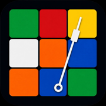

# CubeBeat



A metronome built specifically for drilling Rubik's cube algorithms.

Set a tempo, mark the turns that should land on the click, and gradually ramp up speed without breaking the timing pattern. Single HTML file, works on iPad, iPhone and desktop.

## Inspiration

Built after watching a YouTube video by cubetrainer (https://www.youtube.com/watch?v=eQo8kiGi1x4) about metronome training for speedcubing — the idea that the brain coordinates complex sequences of movement by tracking time, and that giving an algorithm a time signature accelerates how quickly it gets internalised. Worth a search if the technique interests you.

## What it does

Rather than drilling algorithms by raw repetition, drill them against a metronome. The clicks fall not on every turn, but on the *finishing* turns — typically U-face moves or wherever the algorithm naturally lands. Your brain learns when each muscle should fire and in what order, which builds fluid execution at speed rather than the brittle, jittery pattern that comes from blasting through algorithms as fast as you can.

CubeBeat is a tool for that drill, with a few quality-of-life features for cubers.

## Features

- **Steady or Ramp mode** — drill at a fixed tempo, or step the BPM up automatically every N bars
- **3/4 and 4/4 time signatures**
- **Distinctive downbeat** — both audibly (higher click) and visually (white indicator vs amber)
- **Optional screen flash** — red on the downbeat, green on the off-beats — for practising in silence
- **Inline tempo controls** — −5 / −1 / +1 / +5 buttons flanking the BPM display, with press-and-hold for fast change
- **Live tempo adjust** — change BPM mid-drill without stopping
- **Remembers where you left off** — pause practice, come back, pick up at the same BPM
- **OLL / PLL case library** — pick a drill case, track which cases you've practised, filter by set
- **No build, no dependencies, no accounts, no servers** — open the HTML and go

## Quick start on iPad / iPhone

1. Open the live URL in **Safari** (Chrome on iOS doesn't support the next step properly)
2. Tap the Share button → **Add to Home Screen**
3. Tap the new icon — CubeBeat launches fullscreen with a dark theme

If you're hosting on GitHub Pages, enable it under **Settings → Pages → Source: main / root**, and the URL will be `https://ianjohndawson.github.io/CubeBeat/cubebeat.html`.

> **iOS sound note:** Web Audio respects the device's silent / mute switch on iOS. If you can't hear clicks, check the side switch and the volume in Control Centre. CubeBeat includes a silent audio loop trick that bypasses the switch in most cases, but a fully muted device will still be silent.

## How the drill works

Pick an algorithm — H-perm, J-perm, an OLL, whatever. Pick a time signature (4/4 is the usual). Listen to the ticking while running through the algorithm and identify which moves feel like they should land on each click.

Once you have the rhythm start slow — around 60 BPM. Execute the algorithm so the marked moves fall *on* the click, with the rest of the moves filling in between. Repeat for several bars without breaking the rhythm. Bump the tempo a little and repeat. Continue until you can't keep the marked moves on the click cleanly — that's your current ceiling for that algorithm. Practise around that ceiling.

**Worked example.** For H-perm in 4/4 time, each of the four U-face moves becomes an accent. At 60 BPM that gives you a comfortable second between accents — the rest of the algorithm has to slot in and complete by the time the next click arrives. As you ramp the tempo, the windows shrink and the algorithm has to become tighter and more deliberate.

In **Ramp mode**, CubeBeat handles the bumping for you: set the start BPM, the increment, the bars per increment and the target BPM. The metronome auto-ramps and stops when it reaches the target.

## Settings reference

| Setting | What it does |
|---|---|
| Mode | Steady (fixed tempo) or Ramp (auto-increment) |
| Time | 3/4 or 4/4 — beats per bar |
| Tempo | Current BPM (or start BPM in Ramp mode) |
| Increase by | BPM step size for Ramp mode |
| Every | Bars between each Ramp increment |
| Up to | Target BPM at which Ramp stops |
| Screen Flash | Coloured flash on every beat |

Volume follows the device's master volume — there is no in-app volume control.

## Files

- `cubebeat.html` — the app
- `cubebeat-icon-180.png` — home-screen icon (must sit alongside the HTML)
- `cubebeat-icon-512.png` — high-resolution icon (optional, useful if you ever want a manifest)

## Technical notes

- Plain HTML, CSS and JavaScript — no build step, no installed dependencies
- Web Audio API for sample-accurate click timing (regular `setInterval` drifts and is not suitable)
- A short silent `<audio>` loop is started alongside playback to bypass the iOS mute switch where possible
- Wake Lock API keeps the screen awake during drills, on browsers that support it
- Settings persist via `localStorage` under the key `cubebeat.v5`
- Fonts (Fraunces, JetBrains Mono) load from Google Fonts CDN — first load needs internet, then the browser caches them

## Running locally

Clone the repo and open `cubebeat.html` in any modern browser. For full audio behaviour you'll want to serve it over HTTP rather than `file://` — the simplest way is:

```bash
python3 -m http.server 8000
```

Then visit `http://localhost:8000/cubebeat.html`.

## License

This is a small personal project. Use it, modify it, share it. If you publish a fork, an attribution back to this repo is appreciated but not required.
